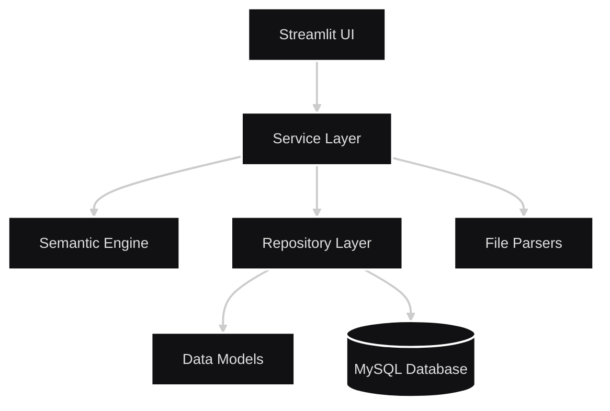

# AI Resume Analyzer

A sophisticated Streamlit application that analyzes resumes against job descriptions using local Ollama AI models, providing intelligent matching scores, gap analysis, and actionable feedback.

## Overview

The AI Resume Analyzer is a production-ready application built with a strict layered architecture that separates concerns between the user interface, business logic, semantic processing, and data persistence. The system leverages local Ollama models for privacy-conscious AI processing and MySQL for robust data storage.

## Features

### Smart Resume Analysis
- **Similarity Scoring**: Uses cosine similarity on embeddings to quantify resume-job match
- **Gap Analysis**: AI-powered critique identifying missing keywords and improvement areas
- **Multi-format Support**: Parse PDF and DOCX files with advanced text extraction 

### User Management
- **Authentication**: Secure login/registration with bcrypt password hashing
- **Guest Mode**: Try the application without creating an account
- **Analysis History**: Track and review past resume analyses 

### Architecture
- **Layered Design**: Clean separation of concerns with dependency injection
- **Repository Pattern**: Abstracted data access for easy database swapping
- **Service Layer**: Business logic orchestration between components

## Architecture

The system follows a unidirectional layered architecture:



### Core Components

- **UI Layer** (`app.py`): Streamlit interface managing user interactions and session state
- **Service Layer** (`services/`): Orchestrates parsing, AI analysis, and persistence
- **Semantic Engine** (`engine/`): Handles Ollama embeddings and similarity calculations
- **Repository Layer** (`repository/`): Manages database operations and CRUD
- **Models** (`models/`): Type-safe dataclasses for data transfer
- **Parsers** (`parsers/`): Extracts text from PDF and DOCX files

## Installation

### Prerequisites
- Python 3.8+
- MySQL 8.0+
- Ollama installed and running

### Setup Steps

1. **Clone the repository**
   ```bash
   git clone https://github.com/AlyKazani04/AI-Resume-Analyzer.git
   cd AI-Resume-Analyzer
   ```

2. **Install dependencies**
   ```bash
   pip install -r requirements.txt
   ```

3. **Configure environment**
   ```bash
   cp .env.example .env
   # Edit .env with your configuration
   ```

4. **Setup Ollama models**
   ```bash
   ollama pull nomic-embed-text
   ollama pull gemma3:latest
   ```

5. **Initialize database**
   ```bash
   mysql -u root -p < schema.sql
   ```

6. **Run the application**
   ```bash
   streamlit run app.py
   ```

## Configuration

The application uses environment variables for configuration. Copy `.env.example` to `.env` and configure:

```env
OLLAMA_EMBEDDING_MODEL=nomic-embed-text
OLLAMA_CHAT_MODEL=gemma3:latest
OLLAMA_HOST=http://localhost:11434
DB_HOST=localhost
DB_USER=root
DB_PASSWORD=your_password
DB_NAME=resume_analyzer
```

## Usage

### As a Registered User
1. Click "Create Account" and register with your email
2. Upload your resume (PDF or DOCX)
3. Paste a job description
4. Click "Analyze Resume" to get your match report
5. View your analysis history in the "History" tab

### As a Guest
1. Click "Continue as Guest" on the login page
2. Upload your resume and job description
3. Get instant analysis without saving to history

## Database Schema

The application uses MySQL with the following tables:

- `users`: User accounts and authentication
- `resumes`: Uploaded resume files and content
- `job_descriptions`: Job description texts
- `analysis_sessions`: Analysis results and metadata

## API Reference

### ResumeAnalyzerService

The main service orchestrating the analysis pipeline :

```python
def analyze(
    self,
    resume: Resume,
    job_description: JobDescription,
    user_id: int | None,
    persist: bool = True,
) -> AnalysisResult
```

### OllamaSemanticEngine

Core AI processing engine:

```python
def similarity_score(self, resume_text: str, jd_text: str) -> float
def gap_analysis(self, resume_text: str, jd_text: str) -> MatchReport
```

## Development

### Project Structure
```
AI-Resume-Analyzer/
├── app.py                 # Streamlit UI entry point
├── config/                # Configuration management
├── engine/                # AI processing engine
├── models/                # Data models
├── parsers/               # File parsing utilities
├── repository/            # Data access layer
├── services/              # Business logic
└── requirements.txt       # Python dependencies
```

### Contributing
1. Fork the repository
2. Create a feature branch
3. Make your changes
4. Add tests if applicable
5. Submit a pull request

## License

This project is licensed under the MIT License - see the [LICENSE](LICENSE) file for details.

## Support

[](https://deepwiki.com/AlyKazani04/AI-Resume-Analyzer)

For issues and questions:
- Check the [wiki](https://deepwiki.com/AlyKazani04/AI-Resume-Analyzer)
- Open an issue on GitHub

---

**Built using Streamlit, Ollama, and MySQL**


Wiki pages you might want to explore:
- [Architecture Overview (AlyKazani04/AI-Resume-Analyzer)](https://deepwiki.com/AlyKazani04/AI-Resume-Analyzer/1.2-architecture-overview)
- [Configuration and Environment (AlyKazani04/AI-Resume-Analyzer)](https://deepwiki.com/AlyKazani04/AI-Resume-Analyzer/8-configuration-and-environment)
